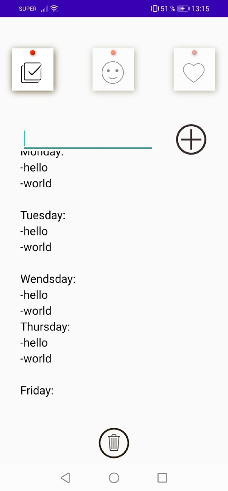
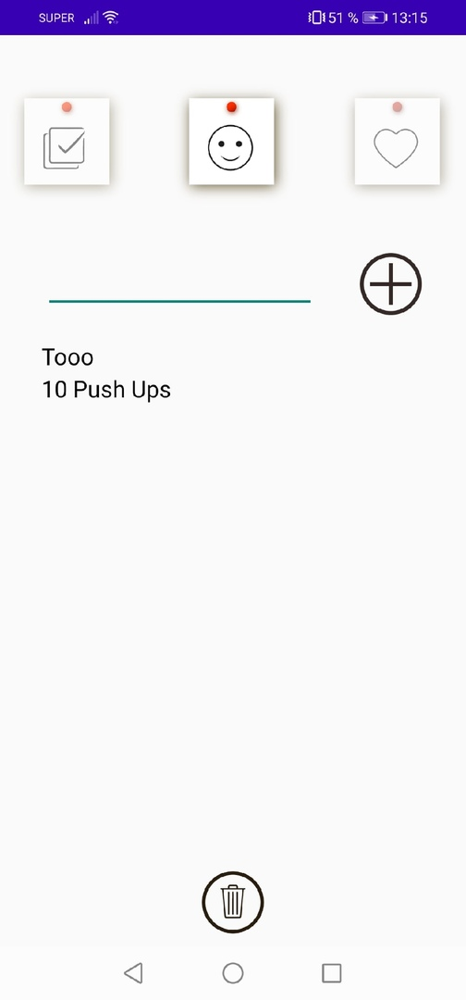
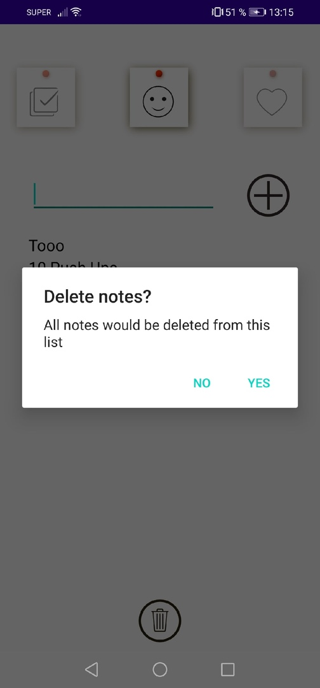

# Notes

Simple note writer, that is used to write notes in 3 categories. All data saves in files and you can reopen app with saved data.

You can choose categories by taping on them and Alpha is being changed, giving the icons fade in and fade out event.

Because this note writer has only basic activities, you can only clear all data and you are not able to edit data inside.

