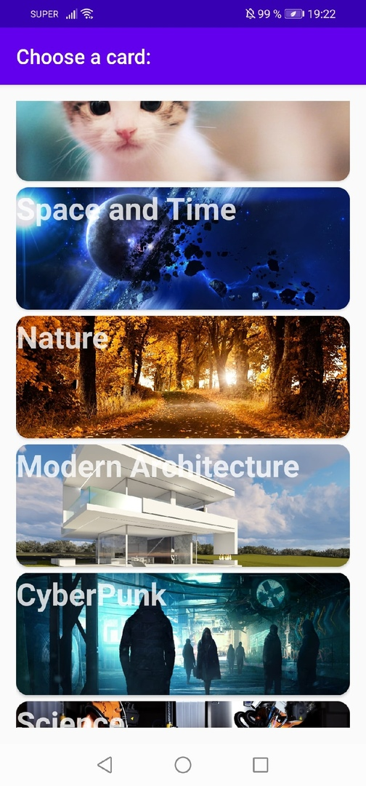
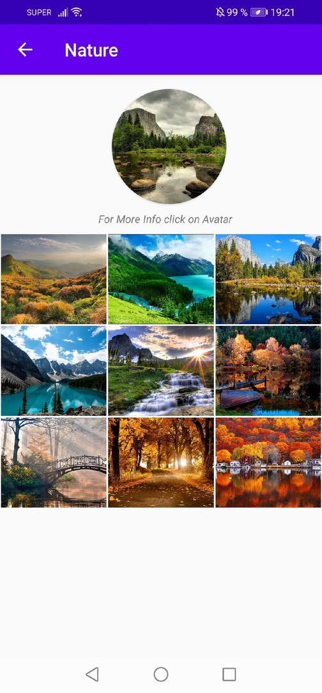

# Smart Gallery with Portfolio

Gallery which can be used to make different applications, such as companies portfolios or just some interesting cards with topics, pictures and etc. Gallery was written using Java in Android Studio.

Scrollable grid on the main screen was made with the help of CardView. By clicking on preferable card, you would be redirected to the next activity, where you will a gallery. This gallery was developed by using RecycleViewer to place different images in rows/columns.

On this stage by clicking on an image user is redirected to another activity which shows bigger versions of images. ScrollView and PageView were used to implement the possibility to swipe from one image to another. Also PhotoViewAttacher was used to zoom in and out from selected image.

The last activity is basic View where you can see text and description.

