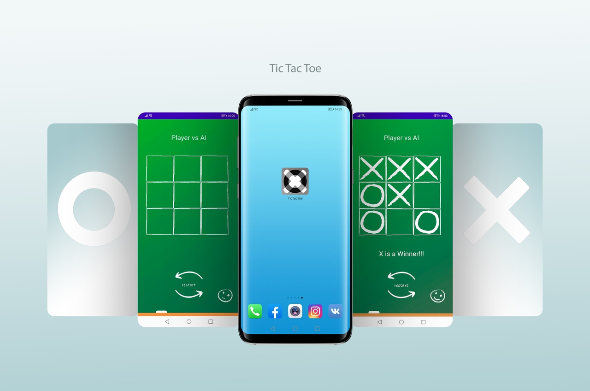

# TicTacToe with AI
Small application that enterprises one of the most popular game in the world Tic Tac Toe. It was written using Java in Android Studio.

The main idea of this project was to make it easy to use and implement medium AI logic that can block your cells, while player has one turn from win. Field where the game starts, was made with GridLayout. Also possible to replace it with RecycleViewer.

### Game Mode
* Player vs Player
* Player vs AI

Design of the game was made by Ljubov Ivtsik.
